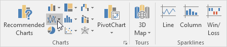
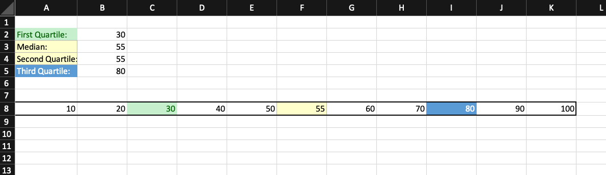
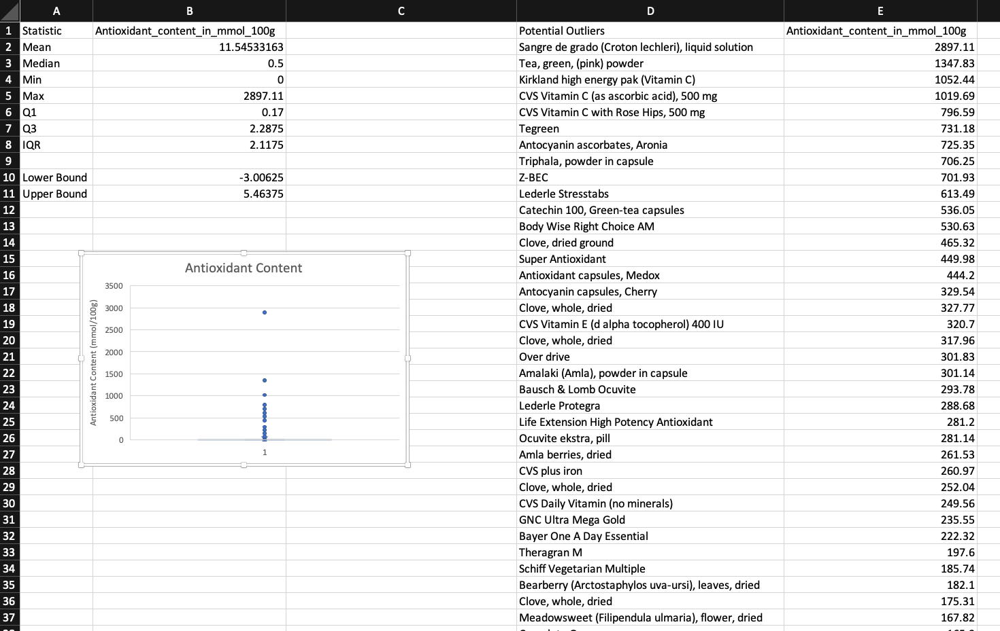
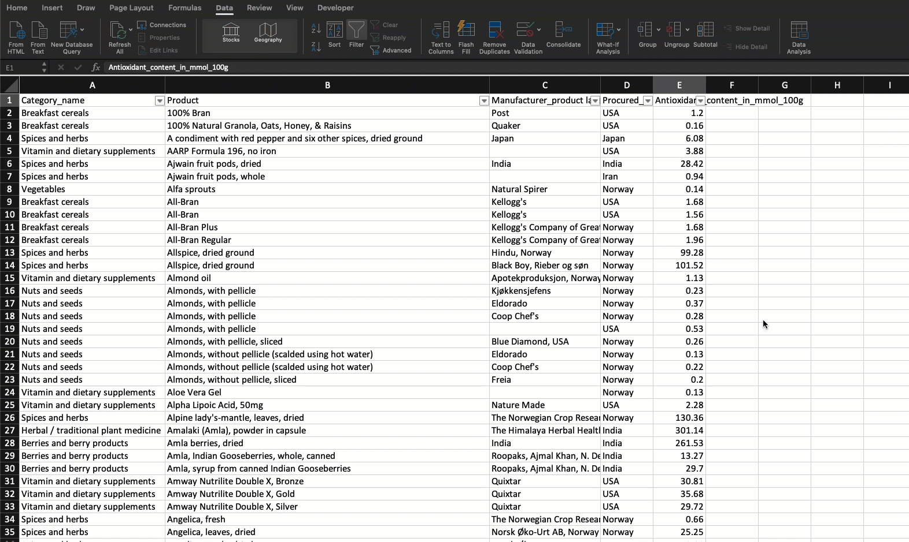

# Module 1 Class 2: Deeper Dive with Excel

## Overview

In today's class, we’ll first walk through this week's Challenge assignment in office hours, and then the students will review VLookups, create line and bar charts, practice creating summary statistics, and add files to their GitHub repository.  

## Learning Objectives

By the end of class, students will be able to:
 
* Feel comfortable using GitHub.
* Create, modify, and stylize charts.
* Be familiar with the statistical terminology. 
* Define and compute each of the three measures of central tendency (mean, median, mode). 
* Identify outliers in data sets using summary statistics.

- - -

## Instructor Notes

* The activities in this class will complement Lessons **1.5.2 Measures of Central Tendency** through **1.6.1 GitHub**. The students will benefit from these activities if they‘ve progressed through these lessons, which cover the following concepts, techniques, and tasks. 

    * Determine the measures of central tendency: mean, median, and mode.
    * Determine the measures of spread: range, variance, standard deviation, and quartiles.
    * Visualize the distribution of data using Box Plots. 
    * Using and adding files to a GitHub repository.

## Slides

[Excel Day 2 slideshow](https://docs.google.com/presentation/d/1QKGEwKpxylFDlY4BvCBKo9Qd58nK44gOaPZcuU2xX54/edit?usp=sharing)

## Student Resources

Share the following [activity resources](https://2u-data-curriculum-team.s3.amazonaws.com/data-viz-online-lesson-plans/01-Lessons/1-2-Student-Resources.zip) with the students.

- - - 

## Before Class

### 0. Office Hours

| Activity Time: 0:30       |  Elapsed Time:     -0:30  |
|---------------------------|---------------------------|

Use the office hours content below to support student's mastery of this week's topics.

<details>
  <summary><strong>📣 0.1 Instructor Do: Challenge Instruction Walk-through</strong></summary>

Open the Challenge in Canvas and go through the high-level instructions and requirements with your class. Be sure to check for understanding.

Open the Rubric in Canvas, go through the Mastery column with your class, and show how it maps back to the requirements for each deliverable. Be sure to check for understanding.

Review the following tips to ensure clarity on the Challenge:

For **Deliverable 1: Outcomes Based on Launch Date**, when charting the percentage of success by goal, they should ensure that they have filtered their data to include only "theater" campaigns. Explain that if they do not, the scope of their data will include all campaigns.

For **Deliverable 2: Outcomes Based on Goals**, when charting the number of projects that were successful, failed, and canceled based on the goal amount, they should ensure they have filtered their data to include only "plays" in the `COUNTIFS()` function. If they do not, the scope of their data will include all campaigns in the "Subcategory" column.

**Note:** The `COUNTIFS()` function is not something that is specifically covered in class content, but it’s something they will need to use to complete the assignment. This was done purposefully to give them the opportunity to dive into documentation, as they would do in the field on a regular basis. To assist the students, we’ll provide them with hints and links to examples as needed when asking them to use a skill that was not covered in the module.

This will be their first time using documentation, and they might feel some hesitation. Remind your class that using Google and documentation is an everyday experience in many different fields that use code to solve problems.

Talk to your class about times when you’ve used documentation to learn something new for work. It’s important for them to understand the practical value of this part of the assignment.

For **Deliverable 3: Written Analysis of the Results**, the learners will write a report based on their analysis. For some learners, this will be their first time writing a report. It might also be the first time your class creates a README.md file for their work. Talk to them about the importance of including a README, and emphasize that it’s a key part of their Challenge submission. If you have any personal recommendations for writing documentation, share them with your class!

</details>

<details>
  <summary><strong> 📣 0.2 Instructor Do: Office Hours</strong></summary>

* Before you begin class, hold office hours. Office hours should be driven by students. Encourage students to take full advantage of office hours by reminding them that this is their time to ask questions and get assistance from instructional staff as they learn new concepts.

* Expect that students may ask for assistance. For example: 

  * Further review on a particular subject
  * Debugging assistance
  * Help with computer issues
  * Guidance with a particular tool

</details>


- - -

## During Class 

### 1. Getting Started

| Activity Time:       0:25 |  Elapsed Time:      0:25 |
|---------------------------|---------------------------|


<details>
  <summary><strong>📣 1.1 Instructor Do: Foundation Setting (0:05)</strong></summary>

* Welcome students to class.

* Direct the students to post individual questions in the Zoom chat to be addressed by you or your TAs at the end of class.

* Open the slideshow and use slides 1-5 to walk through the foundation setting with your class. 

* **This Week - Deeper Dive with Excel:** Talk through the key skills that students will learn this week, and let them know that they are continuing to build on their data analyst skills. 

* **Today's Objectives:** Now, outline the concepts covered in today's lesson. Remind students that they can find the relevant activity files in the “Getting Ready for Class” page in their course content. 

</details>

<details>
 <summary><strong>🎉 1.2 Everyone Do: Check-In (0:05)</strong></summary>

* Ask the class the following questions and call on students for the answers:

    * **Q:** How are you feeling about your progress so far?

    * **A:** Let them know that we are starting to build their skillset. It’s also okay to feel overwhelmed as long as you don’t give up.

    * **Q:** How comfortable do you feel with this topic? 

    * **A:** Let's do "fist to five" together. If you are not feeling confident, hold up a fist (0). If you feel very confident, hold up an open hand (5).

</details>

<details>
  <summary><strong>🎉  1.3 Everyone Do: Adding files to GitHub (0:15)</strong></summary>

* Use slides 6-8 to accompany the beginning of this next activity, and cover the following talking points:

  * Explain that "GitHub offers a centralized location where all developers can push and pull (upload and download) their code."

  * Point out that GitHub always holds the most up-to-date code and files, handling everyone's updates appropriately.

  * Explain that for now, we will only need to know how to use the GUI for GitHub in order to submit homework.

  * Explain that later in the course, we will learn to use Git to work with GitHub through the terminal.

  * Point out to students that, as with many skills, Git and GitHub get easier with use.

* Have the students follow along with these steps:

  * Visit <https://github.com> and ask students to log in to their personal accounts.

  * From the main page, create a new repository with an initialized `README.md` file. Explain that convention in the software world is for each repository to have a "README" file that explains what the repository contains.

    

  * Make the repository public so TAs can have access to it for grading.

  * Click on "Add .gitignore" and type "Python".

    

  * Click the green "Create repository" button. After clicking "Create repository," you’ll now be on the "homepage" of your repository.

    * The purpose of the "gitignore" file that you added to the repository is to ensure that files not tracked by GitHub remain untracked.

    * Click on the `.gitignore` file in your repository to open it.

      

    * In the `.gitignore` file, you can see many different files by extension, as well as distribution packages that won’t be tracked for this repository.

      

    * If you don’t want GitHub to track a file, you can edit the `.gitignore` file by adding the file name or file extension.

    * Let's untrack a common file, `.DS_Store`, for this repository. The `.DS_Store` file is created and maintained by the macOS Finder application in every folder, and it has functions similar to the file `desktop.ini` in Microsoft Windows. We don't see this file in our folders.

      * Click on the pencil icon in the `.gitignore` file to edit the file.
      * Once in edit mode, add the following to the `.gitignore` above the `# Distribution / packaging` section.

      ```python
      # .DS_Store
      .DS_Store
      ```

      * Scroll to the bottom and enter the commit message "Updating .gitignore file." where it says "Commit changes."
      * Click the green "Commit changes" button.

        

  * Switch back to the computer's desktop, create a new, empty Excel file, and save it. This will be used to demonstrate how to upload new files.

  * Navigate back to the repository home page you created, and click **Upload files**.

    

  * Choose your Excel file in the dialog box; instead of the "Upload Files" button, you may also drag files from your desktop to the GitHub webpage for a repo. Add a commit message and commit the changes.

  * Finally, refresh the web page to show that the new file is now safely saved to the repository.

    

* Make sure that all the students have been able to follow along. Let students know that this is how they will submit their homework for the first two weeks. Students will add all of the necessary files to their GitHub repo, then submit the repository link to BCS.

* Encourage students to practice using GitHub.

* Ask the class the following questions and call on students for the answers:

    * **Q:** Where have we used this before?

    * **A:** We created a GitHub account, a repository, and uploaded files in Lesson 1.6.1.

    * **Q:** How does this activity equip us for the Challenge?

    * **A:** We will need to add our final analysis from the Challenge to the GitHub repository we created for this project. 

    * **Q:** What can we do if we don't completely understand this?

    * **A:** We can refer to the curriculum material and reach out to the instructional staff.

* Answer any questions before proceeding to the student activity.

</details>

<sub>[Having issues with this activity? Report a bug!](https://bit.ly/2UfphZJ)</sub>

- - - 

### 2. The Line and Bar Grades

| Activity Time:       0:30 |  Elapsed Time:      0:55  |
|---------------------------|---------------------------|


<details>
  <summary><strong>📣 2.1 Instructor Do: Basic Charting (0:10)</strong></summary>


* During this walk-through, have the TAs send out images of where things are located on both operating systems.

* Use slides 9-12 to accompany the beginning of this next activity, and cover the following talking points:

  * Point out that up until this class, we haven't explored one of the major features of Microsoft Excel: visualizations.

  * Explain that this next activity will be an instructor walk-through of how to generate visualizations in Excel. Most of the commands and concepts are the same across Mac and Windows operating systems, but the software may look a bit different.

  * Reassure students that as we proceed through the walk-through, the TAs will be distributing the images of each step for both operating systems. Therefore, everyone should be able to follow along using their own computers.

  * Explain that today we will concentrate on 4 primary types of plots: scatter plots, line plots, bar plots, and box plots.

* Now, open the [01-Ins_ChartDemo/Resources/CreamFaves.xlsx](Activities/01-Ins_ChartDemo/Resources/IceCreamFaves.xlsx) file and select all of the data in columns A and B. Your selection should include the header rows containing the column labels and all rows containing data. Then, navigate into the `Insert` tab at the top of the application to show off all of the nifty charting options that are available in the Charts group.

* **PC**

  

* **Mac**

  

* Excel allows its users to create many kinds of charts, but first we’re going to create a bar chart because that fits our data nicely.

* Whenever you select a charting option from the Charts group, a new menu will appear that allows us to select various visual options. In the case of bar charts, we can choose between 2D or 3D visuals with a horizontal or vertical layout.

  * For now, just stick with a vertical 2D chart because it is the most basic.

* Once a chart option has been selected, a new chart will automatically be placed in the spreadsheet. Clicking on this chart will allow us to edit it, and, if we wanted to, we could double-click on any one element to edit that piece more specifically.

  * For now, click on the chart's title to show your students that we can rename the chart whatever we would like. Note that its title may be a generic "Chart Title" if you did not include the header rows in your selection.

* **PC**

  * Next, click on the plus sign to the right of our chart. This brings up a list of elements we can add/remove. Some of these elements have sub-elements that we can choose from as well.

    

  * Click on the "Axes Titles" option to add in titles for our vertical and horizontal axes. Then, click on the arrow to the right of the "Axes Titles" option to bring up the sub-menu, which allows us to choose the specific titles we would like to show.

  * By clicking on the paintbrush to the right of a chart, we can choose a number of basic visual styles from a list. We can also select a color scheme for our chart by selecting a palette from the Color group.

    

  * Selecting a new color palette may not seem to make much of a difference at first, but if we double-click on the bars of our chart, a new menu will appear at the side of the application that allows us to format our bars. If we then click on the paint can and select the "Vary colors by point" option, each bar will be given a different color that fits the palette we selected for our chart earlier.

* **Mac**

  * Click on "Add Chart Element" on the left side of the ribbon and move down to "Axis Titles." Here, you can select Primary Horizontal or Vertical.

    

  * Click on "Change Colors" on the ribbon to change the colors of the bar graph (to the right of the "Add Chart Element").

  * Double click on any of the bars to bring up the "Format Data Series" menu. Here we can check the "Vary colors by point" option that will give each bar a different color.

    

* Point out that the format menu for a chart element can be brought up by double-clicking on any specific element. This gives us even more control over the look of our chart. Remember, the exact location of the formatting control may differ between versions of Excel.

* Let's say that we made a bar chart, but then our employer told us they really wanted a pie chart. Luckily for us, Excel has an option that allows us to change a chart's type by simply going into the chart's right-click menu and selecting "Change chart type." This means we can turn a bar chart into a pie chart very easily.

  * You can also change a chart's type by selecting the chart, going into the Design tab's Type group, and clicking "Change Chart Type."

  * Turn that bar chart we’ve been working on into a pie chart. Make sure to add in the "Legend" element for our new pie chart. Otherwise, no one will know what each slice of the pie represents.

    * On Macs, you can add a legend by clicking on "Add Chart Element" on the ribbon again, and select add "Legend" and the location.

      

* Another type of graph that is necessary to understand is the line graph. The problem is that the data we currently have is not exactly ideal for creating a line graph ... Ask your students why this is the case.

  * Our data does not show any trend over time. It instead compares a single piece of data across multiple named categories.

* Next, open [02-Ins_BasicCharting/Solved/BasicCharts.xlsx](Activities/02-Ins_BasicCharting/Solved/BasicCharts.xlsx) in Excel and go to the second sheet, "Ice Cream Sales." This sheet contains data showing how many scoops of ice cream flavors have been sold over a one-year period.

  * Select all of the data on this sheet, then choose a 2D line chart from the Charts group on the Insert tab. Remember, your selection should include the rows and columns containing labels.

    

  * Your students should notice just how cluttered this chart looks, which makes it difficult to glean any information.

    * **PC**: To filter the rows you'd like to show, choose the third option to the right of the chart; this allows us to filter for categories of data we would like to show.

      * Select just a few ice cream flavors from the list, then hit the "Apply" button to filter some data for our chart.

    * **Mac:** To filter what is shown on the chart, choose the `Home` tab, select column `A`, and click `Sort & Filter` in the right of the toolbar (this may be hidden in the `Editing` tab at certain screen sizes). Once your column is in filter mode, click the arrow dropdown in the header cell: from there, you will see options for sorting and filtering.

      

      * Select a few ice cream flavors from the list and show the chart as it updates.

    * It is important to note that the filter options listed here are only helpful in certain cases. When we would like to filter out data based on some condition (e.g., greater than, less than, etc.), these limited filter options will not cut it.

* Send out the activity workbook [02-Ins_BasicCharting/Solved/BasicCharts.xlsx](Activities/02-Ins_BasicCharting/Solved/BasicCharts.xlsx) for students to refer to later.

* Ask the class the following questions and call on students for the answers:

    * **Q:** Where have we used this before?

    * **A:** We created and modified a line chart in Lesson 1.3.2.

    * **Q:** How does this activity equip us for the Challenge?

    * **A:** We will need to create and modify line charts in the Challenge.

    * **Q:** What can we do if we don't completely understand this?

    * **A:** We can refer to the lesson plan and reach out to the instructional staff.

* Answer any questions before proceeding to the student activity.

</details>

<details>
  <summary><strong>✏️ 2.2 Students Do: The Line and Bar Grades (0:15)</strong></summary>

* In this activity, the students are going to assume the role of a teacher and create bar and line charts that visualize the students’ grades over the course of a semester.

* You may choose to use slides 13-15 to accompany this next activity.

* Show the students the [solution](Activities/03-Stu_LineAndBar/Solved/StudentGrades_Solved.xlsx) they will be building, then send out the instructions and starter file below.

* Next, go over the [instructions](Activities/03-Stu_LineAndBar/README.md) with the students and check for understanding.

* Make sure the students can download and open the [instructions](Activities/03-Stu_LineAndBar/README.md) and [starter Excel file](Activities/03-Stu_LineAndBar/Unsolved/StudentGrades_Unsolved.xlsx) for this activity from the AWS link.

* Answer any questions before breaking the students out in groups. 

* Divide students into groups of 3-5. They should work on the solution by themselves, but can reach out to others in their group for help.

* Let students know that they may be asked to share and walk through their work at the end of the activity. 


</details>

<details>
  <summary><strong>⭐ 2.3 Review: The Line and Bar Grades (0:05)</strong></summary>

* Once time is up, bring the students back from their groups and ask for a volunteer, or identify a group that can share their work for a walk-through. Remind them that it is perfectly alright if they didn't finish the activity.

* Review the [solution](Activities/03-Stu_LineAndBar/Solved/StudentGrades_Solved.xlsx) of the activity. Be sure to try to answer any questions they may have before moving on to the next section.

* One of the key factors to cover here is filtering data within the line chart. The chart is overcrowded and difficult to read if we don't choose which students we want to look at specifically or in detail. Sometimes, less data on a chart is more.

  * They'll also need to "Switch Row/Column" from the Chart Design menu on the line graph.

* Send out the activity workbook [03-Stu_LineAndBar/Solved/StudentGrades_Solved.xlsx](Activities/03-Stu_LineAndBar/Solved/StudentGrades_Solved.xlsx) for students to refer to later.

* Ask the class the following questions and call on students for the answers:

    * **Q:** Is there a better type of graph to show the grades for all the students over the semester, instead of a line graph? 

    * **A:** We can use a bar graph, but that is also cluttered. Using the filtering option is probably the best option to make sure the graph is not too cluttered. 

    * **Q:** What can we do if we don't completely understand this?

    * **A:** Practice creating a variety of charts with your own data and filter the data if applicable. 

* Answer any questions before proceeding to the next activity.


</details>

<sub>[Having issues with this activity? Report a bug!](https://bit.ly/36mnHe6)</sub>

- - -

### 3. Summary Statistics 

| Activity Time:       0:30 |  Elapsed Time:      1:25  |
|---------------------------|---------------------------|


<details>
  <summary><strong> 📣 3.1 Instructor Do: Review Central Tendency, Basic Measures, and Distributions (0:15)</strong></summary>

* Let the students know that you’ll be going over the basics of summary statistics, as well as introducing some extensions that we’ll revisit in subsequent modules.

* Use slides 16-42 to accompany the review of the following basic statistical terms. 

Review the following basic terms: 

**Mean:** Sum of all values in the sample divided by the number of values in the sample

**Median:** The value at the midpoint in a set of observed values

**Mode:** The most frequently occurring value in a set of values

**Variable:** Any characteristic that can be measured and change

**Range:** Difference between the lowest and highest values in a set of observations

**Variance:** Average of the squared differences of all values from the mean

**Parameter:** A particular attribute of a population

**Standard deviation:** Square root of the variance; a measure used to quantify the dispersion of a set of observations.

Review the following extensions: 

**Frequency distribution:** Overview of all distinct values of a variable and how frequently each occurs

**Normal distribution:** A probability distribution symmetric around the mean, where data near the mean are more frequent in occurrence than data far from the mean. More specifically, approximately 68% of values fall within one standard deviation of the mean, 95% within two, and 99% within three.

**Standard error:** Standard deviation of the population / square root of the sample size. In practice, sample standard deviation is used

**Central limit theorem:** Proposition that the sampling distribution of the sample means of any variable will be normal if the sample size is large enough

**Estimator:** Sample statistic that attempts to reveal the unknown population parameter

**Histogram:** A chart showing the frequency distribution of a variable


### Introducing our data

Open up the [04-Ins_Stats/Resources/abalone-data-descriptive-stats-02-14-19.xlsx](Activities/04-Ins_Stats/Resources/abalone-data-descriptive-stats-02-14-19.xlsx) data set. Make sure the students have downloaded the same file – `abalone-data-descriptive-stats-02-14-19.xlsx`– from the AWS link. 

* Have them open the file while you explain the importance of EDA. An example is:

### Example EDA Primer: Listening to the Data

Even the most sophisticated statistical methods will fail without first gathering basic information about our data, like averages and ranges. These measures, known as *descriptive statistics*, tell us about the data we have, and those qualities influence what we choose to do with it. This process of “getting to know” our data set is often referred to as “exploratory data analysis,” or EDA.
If necessary, demonstrate mean, median, and mode as profiled below using the abalone data set.

Mean -


Median -


Mode -


***Slack out this diagram:***


**Break Down the Data Types**
Below is an example explanation of the diagram and data types. Feel free to solicit questions and offer examples:

>We say we’re analyzing “data,” but what is that, exactly? Data can take several forms; you’ve run into most of these in the course, but below we visualize the entire “family tree.”

>The first “split” is categorical versus quantitative. The values assigned to categorical variables have a limited number of possibilities: for example; a customer either “Bought” or “Did Not Buy.” This would be a binary variable because there are only two possible outcomes.

>A variable with more than two categories is known as nominal: an example here might be the five boroughs of New York City. Ordinal is a “twist” on the categorical variable in that the ordering of the variables indicates some relationship. For example, “freshman,” “sophomore,” “junior”, and “senior” are four categories of college class arranged from first year to last year.

>By contrast, quantitative variables record attributes that can be measured by magnitude or size. In theory, there is no limit to the different number of values a quantitative variable can take.

>If a variable can take on any value, it’s a continuous variable; otherwise, it’s a discrete variable. An example, here: while individuals described in your data could have any number of heights (58 inches, 58.25 inches, 58.254231 inches, etc.), you can’t have something like 123.5 individuals; that must be a whole number and is thus discrete.

>Now let’s start exploring how our variables vary so that we can experiment on hypotheses we have about the data. In the examples below, we will demonstrate using the abalone data set in Excel on the “whole_weight” and “shucked_weight” measures.

### Variability Measures

Using the abalone data set, demonstrate range, as below:


### Variance and Standard Deviation

Open up [04-Ins_Stats/Resources/calculating-variance-deviation-02-14-19.xlsx](Activities/04-Ins_Stats/Resources/calculating-variance-deviation-02-14-19.xlsx) to walk through an example demonstration. Click on the tabs "variance" and "standard deviation". On the "standard deviation" tab, note that using Excel’s built-in `=STDEV.S(D2:D7)` function, we get the same standard deviation in F14 as in F13 when we use `=SQRT(F11)`.

</details>

<details>
  <summary><strong> 🎉 3.2 Everyone Do: Visualizing Distributions: The Histogram (0:15)</strong></summary>

* For this activity, make sure the students can download and open the [abalone data set](Activities/04-Ins_Stats/Resources/calculating-variance-deviation-02-14-19.xlsx) for this activity from the AWS link. 

* They will use this data set to perform summary statistics and create histograms. 

* For the first part, guide the students in creating the summary statistics in the "descriptive-start" tab. They'll need to calculate the mean, median, mode, min, max, variance, standard deviation, and sample size for the whole weight and shucked weight, as shown in the "descriptive-finish" tab. Encourage them to do this part without copying and pasting.

* Next, guide the students in creating the histograms in the "descriptive-start" tab for the whole weight and shucked weight as shown on the "descriptive-finish" tab. 

* If you’d like to add some pizazz, give them this **Pro tip:** Select the histogram range from bottom to top because Excel will place the chart near wherever you are in the workbook, so this way you will get a chart at the top rather than the bottom of the workbook. You can select the range from bottom to top by going to cell C1, selecting Ctrl + ↓, and then Ctrl + Shift + ↑.

You will get this chart:


It also appears on the second tab of the abalone worksheet.

Do the same for shucked_weight:


***If you have the time, remark on how Excel intelligently placed the values into equally-spaced "bins” and plotted the number of records for each group. Experimenting with these “bin intervals” can provide additional insight into the data. Binning will be revisited later in several visualization modules, especially Tableau.***

</details>


<sub>[Having issues with this section? Report a bug!](https://bit.ly/38BRi5Y)</sub>


- - - 


### 4. Outliers - Drawn and Quartiled

| Activity Time:       0:30 |  Elapsed Time:      1:55  |
|---------------------------|---------------------------|

<details>
  <summary><strong>📣 4.1 Instructor Do: Quantiles, Outliers, and Boxplots (0:10)</strong></summary>

* Use slides 43-45 to accompany the beginning of this next activity and cover the following talking points:

  * Remind students that when we characterize a data set, we need to be careful that our summary statistics don't misrepresent the data.

  * Explain that one of the biggest challenges in statistics is the fact that real-world data is imperfect. Oftentimes, real-world data will contain extreme values that can skew our interpretations, especially when we try to describe the center of a data set.

* You may use slides 46-47 to accompany the next section of the activity and cover the following talking points:

  * Explain that one of the simplest methods of describing real-world data is to break up a data set into smaller segments.

  * Explain that in statistics, we use **quantiles** to describe segments of a data set.

  * Explain that **quantiles** are the "cut points" that separate a sorted data set into equal-sized fragments.

  * Explain that the two most popular types of **quantiles** are **quartiles** and **percentiles**.

  * Explain that **quartiles** divide up a data set into four equal parts, and **percentiles** divide a data set into 100 equal parts.

* Open up the activity workbook [05-Ins_QuantilesOutliersBoxplots/Solved/quantiles_outliers_boxplots.xlsx](Activities/05-Ins_QuantilesOutliersBoxplots/Solved/quantiles_outliers_boxplots.xlsx) and show the students the first sheet.

  

* Explain that this data set is a sorted list of 11 values ranging between 10 and 100.

* Ask the students if they remember what we call the center of a sorted data set.

* If no student can recall, remind them that the center of a sorted data set is known as the median.

* Explain that the median can also be considered the cut point that divides a data set into two equal parts. Therefore, the median can also be called the **second quartile** or **Q2**.

* Point out that the median of this data set is 55. There are five values below 55 and five values above 55.

* Explain that the **first quartile** (also known as **Q1**) is the median of the first set of values separated by **Q2**. Alternatively, the **third quartile** (also known as **Q3**) is the median of the second set of values separated by **Q2**.

* Point out this example is very simplified, and its easy to see where the cut points should be in order to make four equally sized groups of data.

* Show the students the next sheet in the workbook.

  

* Explain that this data is a sorted list of a professional tennis player's serve speeds. In total, 137 measurements were made ranging from 68 to 97 mph.

* Explain that when a data set is large, it can be difficult to determine where the quartiles are.

* Explain that we can use the `QUARTILE.EXC` function in Excel to calculate the quartile values.

* Explain that the input to the `QUARTILE.EXC` function is a range of values and the number corresponding to which quartile it should calculate.

* Point out that in this data set the quartiles divide the data into groups of 34 values, with one group consisting of 35 values.

* Explain that quartiles allow us to make observations about the data set without the need to plot the distribution of values.

* Explain that one observation we can make is that on average, the tennis player serves around 85 mph.

* Explain that another observation we can make is that 50% of the tennis player’s serves were between 77 and 90 mph.

* Explain that because quartiles divide the data into 4 equal segments, the range between Q1 and Q3 covers roughly 50% of all data points.

* Explain that this range is known as the **interquartile range**, or **IQR** for short. In statistics, the **interquartile range** is used to help identify the most trustworthy measurements in a data set. The **interquartile range** is calculated by subtracting Q1 from Q3.

* Use the slides 48-49 covering the following speaking points about Extreme Values to accompany the beginning of this next activity. 

  * Explain that in data science, we call suspicious data points that are at either extreme of a data set **potential outliers**.

  * Explain that an **outlier** is a data point that differs from the rest of a data set.

  * Explain that **outliers** can be caused by changes in data collection methods, experimental error, a malfunction of a machine, or any general source of unaccounted variability when generating a data set.

  * Explain that **outliers** cause a data set to alter its distribution, which causes issues when we try to characterize a data set with summary statistics. Therefore, it is critical to identify **potential outliers** in a data set before moving forward with any analysis.

  * Explain that there are two common ways to identify potential outliers in a data set.

  * Explain that the most common qualitative method to identify potential outliers is using a **box and whisker plot**.

  * Explain that the **box and whisker plot** is also known as a **box plot** and shows the distribution of values from a single list.

  * Explain that the most common quantitative method to identify potential outliers is to use the `1.5*IQR` rule.

  * Explain that the `1.5*IQR` rule states that any data point that is 1.5 times the interquartile range lower than Q1 could be a potential outlier. Alternatively, any data point that is 1.5 times the interquartile range higher than Q3 could be a potential outlier.

* Show the students the next sheet in the workbook.

    

* Explain that the third example is the same tennis serve speed data set, except that there is a new 40 mph data point.

* Explain to the students that with real-world data, it is common to see suspicious data points at the low and high ends of a sorted data set.

* Ask the students if they think that the 40 mph data point is trustworthy based upon the rest of the data.

* Caution students that we have to be careful how we identify and correct outliers.

* Explain that if we remove data points that are not outliers, or if we report data without disclosing that we removed data points, we can be held liable for showing deceptive statistics.

* Explain that in this example, the lower boundary of the `1.5*IQR` rule is 57.5 mph. Therefore, the new 40 mph data point could be considered an outlier, and we could remove that value from our calculations.

* Remind the students that if we removed the potential outlier, it would be critical to report that the value was removed alongside any table or figure generated from the data set.

* Show the students the last worksheet.

    

* Explain that **box plots** are a very powerful plot because they contain a number of summary statistics at a glance.

* Explain that most analytical tools and programming languages have methods to build a **box plot**, and most **box plots** use the same shapes and styles to convey summary statistics.

* Point out to the students the annotated diagram below the Excel chart.

* Explain that the box in a box plot is the interquartile range, and the line in the middle of the box is the median of the data set.

* Explain that sometimes a box plot will include an `X` or triangle in the middle of the box; this symbol indicates the mean of the data set.

* Explain that the lines, or whiskers, protruding from the box indicate the largest and smallest data points inside the `1.5*IQR` rule.

* Explain that the data points plotted past the whiskers indicate the potential outliers.

* Explain that we compare the data points on the box plot to the extreme values of the data set to determine which data points are the potential outliers.

  * In Excel, you can hover over any data point to look at what value is being represented.

* Point out that the Excel box plot shows us that the 40 mph data point from the tennis serve data may be an outlier.

* Point out that in this example, we are looking at a vertical box plot. Explain that just like bar plots can be displayed with vertical or horizontal bars, box plots can also be displayed vertically or horizontally.

* Send out the activity workbook [05-Ins_QuantilesOutliersBoxplots/Solved/quantiles_outliers_boxplots.xlsx](Activities/05-Ins_QuantilesOutliersBoxplots/Solved/quantiles_outliers_boxplots.xlsx) for students to refer to later.

* Ask the class the following questions and call on students for the answers:

    * **Q:** Where have we used this before?

    * **A:** We created box plots in Lesson 1.5.4.

    * **Q:** How does this activity equip us for the Challenge?

    * **A:** Although we will not need to create box plots in the Challenge, understanding the spread of the data and finding outliers is important in data analysis. 

    * **Q:** What can we do if we don't completely understand this?

    * **A:** We can refer to the lesson plan and reach out to the instructional staff.

* Answer any questions before proceeding to the student activity.

</details>

<details>
  <summary><strong>✏️ 4.2 Students Do: Outliers - Drawn and Quartiled (0:15)</strong></summary>

* In this activity, the students are going to search through the antioxidant column for each product and determine if there are any potential outliers in the data set.

* You may use slides 50-51 to accompany this next activity.

* Show the students the [box plot solution](Activities/06-Stu_OutliersDrawnQuartiled/Solved/Outliers_Activity_Solved.xlsx) they will be creating, then send out the instructions and starter file below.

* Next, go over the [instructions](Activities/06-Stu_OutliersDrawnQuartiled/README.md) with the students and check for understanding.

* Make sure the students can download and open the [instructions](Activities/06-Stu_OutliersDrawnQuartiled/README.md) and [starter Excel file](Activities/06-Stu_OutliersDrawnQuartiled/Unsolved/Outliers_Activity_Unsolved.xlsx) for this activity from the AWS link.

* Answer any questions before breaking the students out in groups.

* Divide students into groups of 3-5. They should work on the solution by themselves, but can reach out to others in their group for help.

* Let students know that they may be asked to share and walk through their work at the end of the activity. 

</details>

<details>
  <summary><strong>⭐  4.3 Review: Outliers - Drawn and Quartiled (0:05)</strong></summary>

* Once time is up, bring the students back from their groups and ask for a volunteer or identify a group that can share their work for a walk-through. Remind them that it is perfectly OK if they didn't finish the activity.

* Open the [solution](Activities/06-Stu_OutliersDrawnQuartiled/Solved/Outliers_Activity_Solved.xlsx) and review the first sheet with the students.

* Point out that this data set is over 3000 values, and by just glancing at the data, we can see the antioxidant content jump from less than one to greater than 100.

  * That much variability is indicative of potential outliers in the data set.

* Show the students the next sheet of the workbook.

    

* Explain that the first step in this activity was to create a summary statistics table.

* Explain that once we calculated the first and third quartiles, we could calculate the `1.5*IQR` boundary rule.

* Remind the students that the lower boundary of the `1.5*IQR` rule is `Q1-(1.5*IQR)`, while the upper boundary is `Q3+(1.5*IQR)`.

* Point out that the lower boundary extends beyond the minimum antioxidant value. Therefore, all values lower than the median are within the boundary.

* Explain that once we have the upper boundary, we can use this value in the filter of the raw data.

* Demonstrate to the students how to copy the upper bound to create a "Greater than" filter.

    

* Explain that once we have the filtered list of potential outliers, we copy over the product name and antioxidant content to our worksheet.

* Explain that the final step is to create a box and whisker plot using all of the antioxidant values.

* Point out that the box and whisker plot may look a bit different. There does not appear to be a box; instead, there is a line.

* Explain that when there are large extremes in the data, the box and whisker plot gets compacted.

* Point out to the students that the median is 0.5, the IQR is 2.12, and the upper boundary is 5.46. However, the largest values are almost 3000.

* Explain that this compacted box plot is typically observed when potential outliers are orders of magnitude larger than the median.

* Explain that box plots are great at showing us when there are outliers in a data set, but they are not very helpful when determining how many potential outliers exist.

* Explain that this is why many data scientists will start by plotting the data in a box and whisker, and reflex to quantifying the `1.5*IQR` boundaries if any potential outlier data points exist.

* Send out the solution workbook [06-Stu_OutliersDrawnQuartiled/Solved/Outliers_Activity_Solved.xlsx)](Activities/06-Stu_OutliersDrawnQuartiled/Solved/Outliers_Activity_Solved.xlsx) for students to refer to later.

* Ask the class the following questions and call on students for the answers:

    * **Q:** From a data analyst perspective, how would you avoid the large variability in antioxidant levels in this data set? 

    * **A:** We could filter the amount of antioxidant by food category, country, product, and where it is manufactured, and then create separate box plots and summary statistics based on these categories. 

    * **Q:** What can we do if we don't completely understand this?

    * **A:** Filter the data set, create summary statistics based on food category, then create a box plot on this data.  

* Answer any questions before ending class.

</details>

<sub>[Having issues with this activity? Report a bug!](https://bit.ly/3nc8Ae0)</sub>

- - -

### 5. Ending Class 

| Activity Time:       0:05 |  Elapsed Time:      2:00  |
|---------------------------|---------------------------|

<details>
  <summary><strong>📣  5.1 Instructor Do: Review (0:05)</strong></summary>

* Before ending class, review the skills that were covered today and mention where in the module these skills are introduced. 
  * Creating and modifying line charts was covered in **Lesson 1.3.2**.
  * Creating box plots was covered in **Lesson 1.5.4**.
  * Creating a GitHub repository was covered in **Lesson 1.6.2**.

* Answer any questions the students may have.

* Finally, encourage your class to begin the Challenge as soon as possible, if they have not already begun, and to use the Learning Assistants channel and pre-scheduled Office Hours with their instructional team for help as they progress through their work. If they feel like they need context to understand documentation or instructions throughout the week, this is where they can get it. 

</details>

- - -


© 2021 Trilogy Education Services, LLC, a 2U, Inc. brand.  Confidential and Proprietary.  All Rights Reserved.
